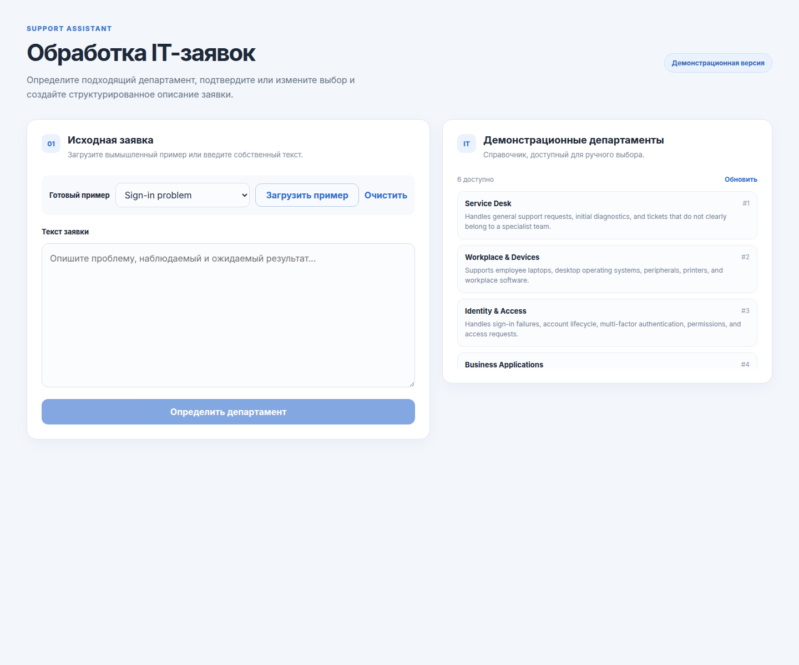

# Support Assistant

[English](README.md) · [Русский](README.ru.md)

> **Status: Under Development** — active work is maintained in the [`develop`](../../tree/develop) branch.

Support Assistant is a public demonstration application that turns an unstructured IT support request into a routed, reviewable, and consistently formatted ticket. It uses OpenRouter's free-model router while keeping the API key and all LLM traffic on the backend.

## The problem

Support requests often arrive as free-form text. A support agent must identify the responsible team, verify that choice, and rewrite the report into a useful template. Support Assistant speeds up those repetitive steps without removing human control: an LLM proposes a department and explains why, while the user confirms or changes the final assignment before description generation.

## Features

- LLM-assisted ticket title and IT-department routing.
- Visible routing rationale and an explicit confirmation step.
- Manual department override with no second LLM request.
- Description generation that uses the user-confirmed `department_id`.
- Three fictional example tickets, an editable template, and reset controls.
- Idempotent initialization of six fictional IT departments.
- OpenRouter integration restricted to `openrouter/free` and `:free` models.
- JSON Schema structured output, Pydantic validation, timeouts, retries, and safe API errors.
- Responsive Vue interface, FastAPI API, SQLite persistence, migrations, and healthchecks.
- A single Docker Compose entry point with only the frontend bound to localhost.

## Demo



Typical workflow:

1. Load a fictional request or enter your own.
2. Ask the assistant to propose a department.
3. Review the proposed department and rationale.
4. Confirm it or select another department from the directory.
5. Edit the description template and generate the final text.

The screenshot was captured from the Docker Compose deployment and contains demonstration data only.

## Technology stack

| Area | Technology |
| --- | --- |
| Frontend | Vue 3, TypeScript, Vite, Vitest, Vue Test Utils, ESLint, Prettier |
| Backend | Python 3.14, FastAPI, Pydantic, SQLAlchemy async, Alembic, OpenAI-compatible SDK |
| LLM | OpenRouter free model router, JSON Schema structured outputs |
| Storage | SQLite with a persistent Docker volume |
| Runtime | Docker Compose, Nginx reverse proxy, container healthchecks |

## Architecture

The browser calls only relative `/api` endpoints. Nginx serves the compiled SPA and proxies those requests to FastAPI on the private Compose network. FastAPI orchestrates application services behind routing and drafting ports. OpenRouter connectors implement those ports and validate every model response before it reaches the API. SQLAlchemy repositories isolate department persistence.

```text
Browser -> Nginx/Vue -> FastAPI routes -> application services
                                     |-> department repository -> SQLite
                                     `-> LLM ports -> OpenRouter free models
```

The named Compose network (`support-assistant-network`) can later be attached to an external reverse proxy. No ProjectRouter or Caddy integration is included yet.

## Run with Docker Compose

Requirements: Docker with Compose v2 and an [OpenRouter API key](https://openrouter.ai/keys).

```bash
cp .env.example .env
# Set OPENROUTER_API_KEY in .env
docker compose up --build -d
```

Open <http://127.0.0.1:8080>. Check status with:

```bash
docker compose ps
curl http://127.0.0.1:8080/api/health
```

Stop containers without deleting stored data:

```bash
docker compose down
```

The backend is not published on a host port. SQLite data is retained in the `support-assistant-data` named volume. Migrations run before the API starts, and missing demo departments are added safely without duplicating existing rows.

## Configuration

| Variable | Required | Default | Purpose |
| --- | --- | --- | --- |
| `OPENROUTER_API_KEY` | Yes for LLM actions | — | Backend-only OpenRouter credential |
| `OPENROUTER_MODELS` | No | `openrouter/free` | Comma-separated fallback order; only `openrouter/free` or IDs ending in `:free` are accepted |
| `OPENROUTER_TIMEOUT_SECONDS` | No | `60` | Per-request timeout, 1–180 seconds |
| `OPENROUTER_MAX_RETRIES` | No | `2` | SDK retries for transient failures, 0–3 |
| `OPENROUTER_SITE_URL` | No | empty | Optional attribution URL sent to OpenRouter |
| `DATABASE_URL` | No | Compose-managed SQLite URL | SQLAlchemy database URL for non-Compose deployments |

Do not place a real key in any tracked file. The frontend bundle never receives the key.

## API

| Method | Endpoint | Purpose |
| --- | --- | --- |
| `GET` | `/api/health` | Container and reverse-proxy health signal |
| `GET` | `/api/departments` | List available departments |
| `POST` | `/api/tickets/route` | Propose title, department, and rationale |
| `POST` | `/api/tickets/process` | Generate a description for the supplied final department |

Interactive OpenAPI documentation is available at `/docs` when the backend is accessed directly in a development setup.

## Development and testing

Backend:

```bash
cd backend
python3 -m venv .venv
.venv/bin/pip install -r requirements.dev.txt
.venv/bin/python -m ruff check .
.venv/bin/python -m ruff format --check .
.venv/bin/python -m mypy app
.venv/bin/python -m pytest
```

Frontend:

```bash
cd frontend
npm ci
npm run check
npm run build
```

Automated tests use mocks and local transports; they never make real OpenRouter requests.

## Component documentation

- [Frontend technical documentation](frontend/README.md)
- [Backend technical documentation](backend/README.md)

## License

Distributed under the [MIT License](LICENSE).
